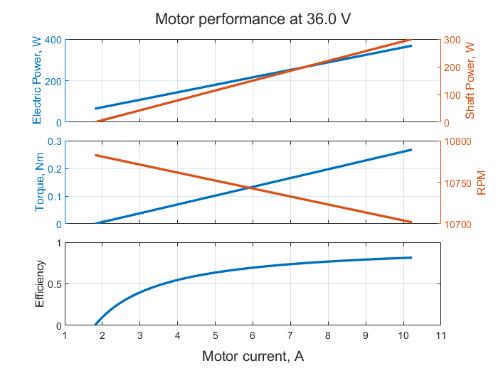
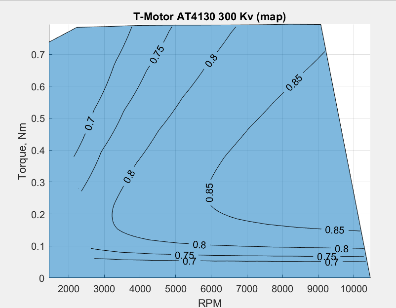
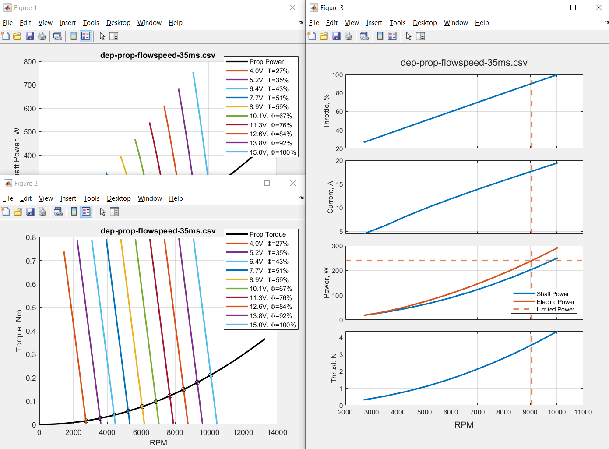

# simple-BLDC-model
A simple (and probably inaccurate) brushless DC motor modelling script.

This software is entirely written in MATLAB and comes with two main files (a standard MATLAB script and a MATLAB live script) and a MATLAB function. The MATLAB live script includes also the mathematical theory behind the software and it has been already exported as PDF to be used as user manual.

Both the standard and the live script call the same MATLAB function to calculate the motor performance and both show the same charts in the end. The difference is that the MATLAB live script is interactive and shows live updates when changing the input parameters, while the MATLAB standard script can be easily expanded with other features or be included in other programs.

## Additional features
Actually, the `main.m` script also plots the motor map. The additional `propMatchCustom.m` script provides matching between motor and propeller, where the latter's data are loaded from external file.

